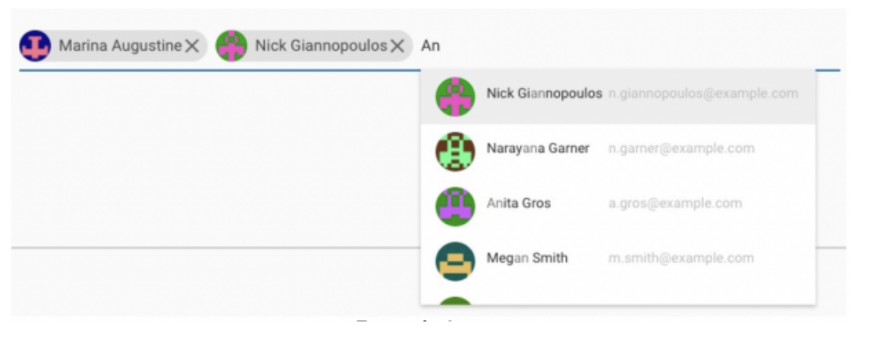

# Chip Component Implementation

This document outlines the design and implementation of a custom chip component using React. The component follows specific requirements for functionality and appearance.

## Example Image

## Specifications

- **Dynamic List Display**: When the input field is clicked, a list of items appears.
- **Filtering Functionality**: As the user types in the input field, the list dynamically shows only items that match the input.
- **Chip Creation**: Clicking on an item from the list turns it into a chip that appears above the input field. The input field adjusts accordingly.
- **Unique Selection**: Once an item becomes a chip, it's removed from the dropdown list.
- **Removable Chips**: Each chip includes an "X" icon. Clicking this icon removes the chip and returns the item to the list.
- **Backspace Interaction**: When the input is blank, pressing backspace highlights the last chip. Pressing backspace again deletes the highlighted chip.

### Bonus Tasks

- **TypeScript Integration**: Implement the component using TypeScript for type safety and better maintainability.
- **Clean Code**: Ensure the code is well-organized and follows best practices.

## Implementation Notes

- **Framework**: The component is built using React (Create React App or Next.js).
- **No External Component Libraries**: The component should be built from scratch without using libraries like MUI or Chakra UI.
- **Styling**: Allowed CSS solutions include TailwindCSS or SCSS.

## Deadline

The implementation should be completed by the end of the day on January 16th, 2024.
